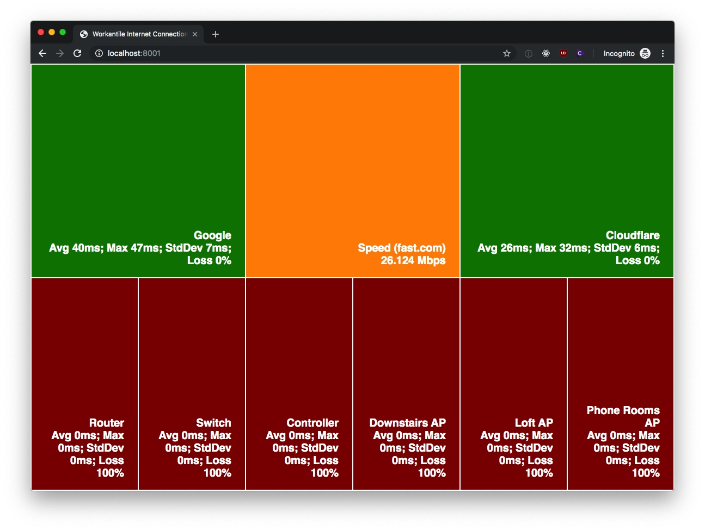

# workantile internet connection status display



## requirements

- a working Go installation.

## build & run

```shell script
go build -o display .
# (use /usr/local/go/bin/go if you don't have Go in your path)
./display
```

## config

configuration is stored in constants in `main.go`. the server address/port, ping and speedtest intervals, and ping target addresses are all configurable there.

## raspberry pi setup

### install go

(see eg: https://blog.alexellis.io/golang-docker-rpi/)

```shell script
mkdir -p ~/tmp/go && pushd ~/tmp/go
wget https://dl.google.com/go/go1.13.1.linux-armv6l.tar.gz
sudo mkdir -p /usr/local/go
sudo tar -xvf go1.13.1.linux-armv6l.tar.gz -C /usr/local/go --strip-components=1
popd
```

### clone & build

```shell script
cd /home/pi
git clone https://github.com/workantile/internet-status-display.git
pushd internet-status-display
/usr/local/go/bin/go build -o display .
popd
```

### server systemd unit

in `/etc/sysctl.conf`:

```
net.ipv4.ping_group_range=0 2147483647
```

(then reboot)

in `/etc/systemd/system/internet-status-display.service`:

```
[Unit]
Description=Internet Status Display

[Service]
WorkingDirectory=/home/pi/internet-status-display
ExecStart=/home/pi/internet-status-display/display
Restart=always
StandardOutput=syslog
StandardError=syslog
SyslogIdentifier=internet-status-display
User=pi
Group=pi

[Install]
WantedBy=multi-user.target
```

```shell script
sudo chmod u+rwx /etc/systemd/system/internet-status-display.service
sudo systemctl enable internet-status-display
sudo systemctl start internet-status-display
```

### kiosk mode

(see: https://pimylifeup.com/raspberry-pi-kiosk/)

```shell script
sudo apt-get install unclutter sed
sudo raspi-config
# in raspi-config: 3 Boot Options -> B1 Desktop / CLI -> B4 Desktop Autologin
```

in `/home/pi/kiosk.sh`:

```
#!/usr/bin/env bash

xset s noblank
xset s off
xset -dpms
unclutter -idle 0.5 -root &

sed -i 's/"exited_cleanly":false/"exited_cleanly":true/' /home/pi/.config/chromium/Default/Preferences
sed -i 's/"exit_type":"Crashed"/"exit_type":"Normal"/' /home/pi/.config/chromium/Default/Preferences

/usr/bin/chromium-browser --noerrdialogs --disable-infobars --kiosk http://localhost:8001/
```

in `/etc/systemd/system/kiosk.service`:

```
[Unit]
Description=Chromium Kiosk
Wants=graphical.target
After=graphical.target

[Service]
# REPLACE 0 by the output of echo $DISPLAY
Environment=DISPLAY=:0.0
Environment=XAUTHORITY=/home/pi/.Xauthority
Type=simple
ExecStart=/bin/bash /home/pi/kiosk.sh
Restart=on-abort
User=pi
Group=pi

[Install]
WantedBy=graphical.target
```

```shell script
sudo chmod +x /home/pi/kiosk.sh
sudo chmod u+rwx /etc/systemd/system/kiosk.service
sudo systemctl enable kiosk.service
sudo systemctl start kiosk.service
```
